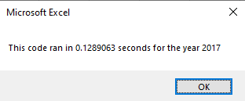

# VBA of Wall Street

## Overview of Project
Steve has asked us to refactor our code so that he can expand his dataset. He is worried that our current practice will take too long to compile with a large dataset, specifically he is concerned about our existing for loop. With the first version of the code, we iterated through the entire dataset twelve times, once for each value within the array "tickers." We have offered to refactor the code such that it will only run through the database one time, instead of twelve times.

## Results
By refactoring the code, we were able to markedly reduce the runtime of the script.
For 2017 data, the initial code took .59375 seconds to run. After refactoring, the code took 9.765625E-02 seconds to run. This represents a significant reduction in run time.


For 2018 data, the initial code took .5976563 seconds to run. After refactoring, the code took 9.765625E-02 seconds to run. This represents a significant reduction in run time.


## Summary

These time savings were primarily the result of changing how we iterate through the data. In the original code, we iterate through the entire dataset once for each value within the array "tickers." 

This is the code from the original script - "Sub yearValueAnalysis()" - from lines 34-40.
```vba
'4) Loop through tickers
   For i = 0 To 11
       ticker = tickers(i)
       totalVolume = 0
       '5) loop through rows in the data
       Worksheets(yearValue).Activate
       For j = 2 To RowCount
```
In this code we see that the for loop to explore the data set (designated by comment 5) is nested within the for loop to iterate through the ticker array (designated by comment 4). Because we are nesting our for loops in this order, we end up exploring the entire dataset 12 times. 

In order to increase the efficiency of the script, the refactored code only has one for loop. Before we initiate the for loop, we create a "tickerIndex" variable with the value of zero.
```vba
'1a) Create a ticker Index
   tickerIndex = 0
```
As we explore the dataset, we change the tickerIndex once the value within the Ticker column no longer matches the value within the tickers array. This allows us to iterate through the tickers array, updating tickerVolumes, tickerStartingPrices, and tickerEndingPrices for all values of within the tickers array without needing to iterate through the dataset multiple times.
```vba
 '2b) Loop over all the rows in the spreadsheet.
    Worksheets(yearValue).Activate
    For i = 2 To RowCount
        If Cells(i, 1).Value = tickers(tickerIndex) Then
        
        '3a) Increase volume for current ticker
        tickerVolumes(tickerIndex) = tickerVolumes(tickerIndex) + Cells(i, 8).Value
        End If
        
        '3b) Check if the current row is the first row with the selected tickerIndex.
        If Cells(i - 1, 1).Value <> tickers(tickerIndex) And Cells(i, 1).Value = tickers(tickerIndex) Then
            tickerStartingPrices(tickerIndex) = Cells(i, 6).Value
        End If
        
        '3c) check if the current row is the last row with the selected ticker
        If Cells(i + 1, 1).Value <> tickers(tickerIndex) And Cells(i, 1).Value = tickers(tickerIndex) Then
             tickerEndingPrices(tickerIndex) = Cells(i, 6).Value
             
             '3d Increase the tickerIndex.
             tickerIndex = tickerIndex + 1
             
        End If
    Next i
```

#### What are the advantages or disadvantages of refactoring code?
Refactoring code is an important practice for all developers and analysts. As analysts, we rarely need to re-invent the wheel when we are coding. There are often other scripts and code out there that we can review, modify, improve, and otherwise tweak to meet our needs. By refactoring code, we are taking something that already works and trying to make it work better, or to extend to a new application beyond the original intent of the code. 

Refactoring code extends the life of code, and saves development time by allowing us to make use of what is already out there instead of starting from scratch. Additionally, by analyzing code that other write, we may learn best practices and techniques that we don't already have under our belt.

#### How do these pros and cons apply to refactoring the original VBA script?
The refactored code runs faster than the original code, however the code does require two assumptions to be true. The code will only work if:
<ol>
<li>The data is primarily sorted with the ticker fields in the same order as the ticker array items. (ascending alphabetically)
<li>The data is secondarily sorted with the entries in chronological order, from first to last trading days within the year. (ascending chronologically)
</ol>
   
The original code required the second assumption to be true, but does not require the ticker items to be listed in ascending alphabetical order or to share the same order as the values within the "ticker" array.

The refactored code is stronger than the original code, despite requiring some additional assumptions regarding data ordering to be true in order for it to work. Since stock data is often ordered by date, instead of by ticker, it may be better for the VBA script to include a section that sorts the data prior to analysis. If the script sorted the data before it ran the analysis, then the code would be assured to return correct information. 

For example, this code block will sort the data in the correct way to ensure that the assumptions are met (as long as the values within the tickers array are also alphabetically ordered).
```vba
With Worksheets(yearValue)
     With .Cells(1, "A").CurrentRegion
         .Cells.Sort Key1:=.Range("A1"), Order1:=xlAscending, _
                     Key2:=.Range("B1"), Order2:=xlAscending, _
                     Orientation:=xlTopToBottom, Header:=xlYes
     End With
 End With
```
If we add the sort to the refactored code, the run time becomes .1289063 seconds. We lose some of the efficiency from the funcition without a sort (9.765625E-02 seconds) but end up with a time that is still significantly faster than the original code (.59375 seconds).


