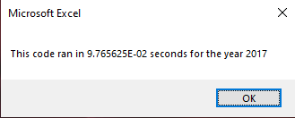
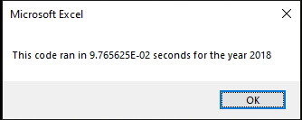

# VBA of Wall Street

## Overview of Project
Steve has asked us to refactor our code so that he can expand his dataset. He is worried that our current practice will take too long to compile with a large dataset, specifically he is concerned about our existing for loop. With the first version of the code, we iterated through the entire dataset twelve times, once for each value within the array "tickers." We have offered to refactor the code such that it will only run through the database one time, instead of twelve times.

## Results
By refactoring the code, we were able to markedly reduce the runtime of the script.
For 2017 data, the initial code took .59375 seconds to run. After refactoring, the code took 9.765625E-02 seconds to run. This represents a significant reduction in run time.

For 2018 data, the initial code took .5976563 seconds to run. After refactoring, the code took 9.765625E-02 seconds to run. This represents a significant reduction in run time.

## Summary

####What are the advantages or disadvantages of refactoring code?

####How do these pros and cons apply to refactoring the original VBA script?
